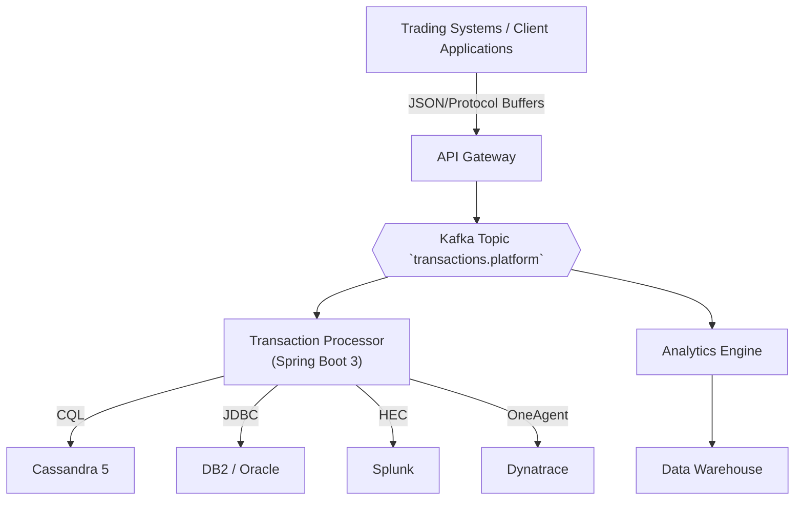

# High-Performance Transaction Processing Platform


A _zero‑compromise_ real‑time transaction processing platform engineered to handle __20 billion+ records per day__ while sustaining __25,000 TPS__ at __sub‑100ms p99__.  
Built with JP Morgan Chase's exacting standards for reliability, security, and performance.

---

## 1 · Architecture (50,000‑ft view)



- __Stateless edge__ processes high-volume transaction flows with __Kafka__ for guaranteed delivery
- __Transaction Processor__ (Loom‑threaded Spring Boot) validates, persists to __Cassandra__ (OLTP) + __DB2__ (source‑of‑truth) with __Exactly‑Once__ semantics
- __Analytics Engine__ performs real‑time aggregations feeding enterprise data warehouse
- __Observability__: Enterprise‑grade monitoring with Splunk, Dynatrace, Prometheus, and Grafana

_Detailed architecture documentation in `docs/architecture.md`._

---

## 2 · Quick Start (Dev)

```bash
git clone https://github.com/jpmorgan-chase/transaction-processing-platform.git
cd transaction-processing-platform
./mvnw clean package -DskipTests              # build everything
docker compose up                             # ZK, Kafka, Cassandra, Platform
curl -XPOST http://localhost:8080/v1/transactions \
     -H "Content‑Type: application/json"         \
     -d '{"accountId":"987654321",
          "amount":145.22,
          "currency":"USD",
          "description":"Trade settlement"}'
```

---

## 3 · Module Guide

| Module              | Description                                    | Stack                             |
| ------------------- | ---------------------------------------------- | --------------------------------- |
| __transaction‑processor__  | High‑performance validator & dual‑writer | Java 21, Spring Boot 3, Kafka 3.7 |
| __analytics‑engine__       | Real‑time aggregations & ML pipeline           | Scala 2.13, Spark 3.5             |
| __infra/terraform__ | EKS, MSK, RDS, Enterprise monitoring            | Terraform 1.9                     |

---

## 4 · CI / CD

- __GitHub Actions__ – automated build, test, security scan, container publish
- __Jenkinsfile__ – enterprise pipeline with approval gates and K8s deployment
- __Infrastructure as Code__ – security scanning, compliance validation, automated deployment

---

## 5 · API Contract

```http
POST /v1/transactions
Content‑Type: application/json
{
  "accountId": "string",
  "amount": 125.95,
  "currency": "USD",
  "description": "Transaction description",
  "merchantId": "string",
  "category": "string"
}
```

Enterprise validation rules with full OpenAPI specification at `/swagger-ui.html`.

---

## 6 · Quality & Testing

```bash
./mvnw verify          # unit + integration + compliance tests
./mvnw jacoco:report   # > 95% line coverage required
mvn -Pperf gatling:test # performance benchmarking
```

---

## 7 · Deployment

```bash
cd infra/terraform/aws
terraform init && terraform apply
kubectl apply -f k8s/transaction-processing-platform.yaml
```

Zero‑downtime blue‑green deployment with enterprise‑grade monitoring and alerting.

---

© 2025 JPMorgan Chase & Co. · Licensed under Apache 2.0
