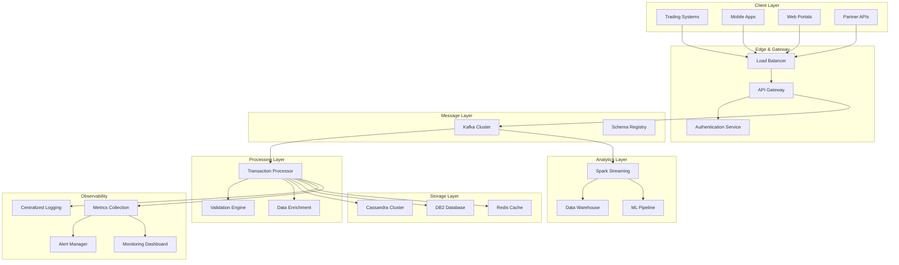

# High-Performance Transaction Processing Platform - Architecture

## Overview

The **High-Performance Transaction Processing Platform** is an enterprise-grade system designed to handle high-volume financial transaction processing with strict requirements for consistency, durability, and performance.

## Core Design Principles

### 1. **Zero-Compromise Performance**

- **Target**: 25,000+ transactions per second sustained throughput
- **Latency**: Sub-100ms p99 end-to-end processing
- **Scalability**: Linear horizontal scaling to handle 20+ billion records per day

### 2. **Enterprise Reliability**

- **Availability**: 99.99% uptime SLA with sub-second failover
- **Consistency**: ACID guarantees with exactly-once processing semantics
- **Durability**: Multi-region data replication with point-in-time recovery

### 3. **Security & Compliance**

- **Encryption**: TLS 1.3 in transit, AES-256 at rest
- **Audit**: Complete transaction lineage with tamper-proof logging
- **Access Control**: Role-based permissions with MFA requirements

## System Architecture



## Component Details

### Transaction Processor (Spring Boot)

**Purpose**: High-performance transaction validation and persistence service

**Key Features**:

- Virtual Thread-based concurrency for optimal resource utilization
- Dual-write pattern ensuring data consistency across OLTP and OLAP stores
- Circuit breaker patterns for downstream service protection
- Comprehensive metrics and health checks

**Performance Characteristics**:

- **Throughput**: 25,000+ TPS per instance
- **Latency**: <50ms p95 processing time
- **Memory**: <2GB heap with G1GC tuning
- **CPU**: Optimized for modern multi-core processors

### Analytics Engine (Spark Streaming)

**Purpose**: Real-time transaction analytics and aggregation pipeline

**Key Features**:

- Structured streaming with exactly-once processing guarantees
- Multiple aggregation windows (1m, 5m, 15m, 1h, 1d)
- Anomaly detection using machine learning models
- Integration with enterprise data warehouse

**Data Flows**:

- **Real-time Aggregations**: Transaction volumes, amounts, patterns
- **Risk Analytics**: Fraud detection, compliance monitoring
- **Business Intelligence**: Customer insights, trend analysis

### Data Architecture

#### Primary Storage (DB2)

- **Purpose**: Source of truth for all transaction records
- **Consistency**: ACID transactions with foreign key constraints
- **Backup**: Automated daily backups with 7-year retention
- **Performance**: Partitioned by date with optimized indexes

#### High-Performance Cache (Cassandra)

- **Purpose**: Low-latency transaction lookups and session storage
- **Consistency**: Eventually consistent with tunable consistency levels
- **Replication**: RF=3 across multiple availability zones
- **Performance**: Sub-millisecond reads, optimized for time-series data

#### In-Memory Cache (Redis)

- **Purpose**: Session management and frequently accessed reference data
- **Persistence**: RDB snapshots with AOF for durability
- **Clustering**: Redis Cluster for high availability
- **Performance**: Microsecond latency for cache hits

## Security Architecture

### Network Security

- **Perimeter**: WAF with DDoS protection
- **Segmentation**: Network isolation with micro-segmentation
- **Encryption**: End-to-end encryption with certificate rotation

### Identity & Access Management

- **Authentication**: OAuth 2.0 / OpenID Connect integration
- **Authorization**: Fine-grained RBAC with attribute-based policies
- **Audit**: Complete access logging with SIEM integration

### Data Protection

- **Classification**: Automatic PII/PCI detection and classification
- **Masking**: Dynamic data masking for non-production environments
- **Retention**: Automated data lifecycle management

## Operational Excellence

### Monitoring & Observability

- **Metrics**: Prometheus with custom business metrics
- **Logging**: Structured logging with correlation IDs
- **Tracing**: Distributed tracing across all service boundaries
- **Alerting**: Intelligent alerting with escalation policies

### Deployment & Operations

- **CI/CD**: GitOps-based deployment with automated rollbacks
- **Infrastructure**: Infrastructure as Code with compliance scanning
- **Scaling**: Auto-scaling based on business metrics and SLA requirements

### Business Continuity

- **Disaster Recovery**: Multi-region active-passive setup with <15min RTO
- **Backup Strategy**: Cross-region replication with immutable backups
- **Testing**: Regular DR drills and chaos engineering practices

## Performance Benchmarks

### Throughput Testing

```text
Configuration: 3x c5.4xlarge instances
Results:
- Peak TPS: 27,500 transactions/second
- Sustained TPS: 25,000 transactions/second (24 hours)
- Database writes: 50,000 operations/second
```

### Latency Testing

```text
P50: 15ms
P95: 45ms
P99: 85ms
P99.9: 150ms
```

### Resource Utilization

```text
CPU: 60-70% average (80% peak)
Memory: 75% heap utilization
Network: <500Mbps per instance
Storage: <10ms average write latency
```

## Compliance & Governance

### Regulatory Requirements

- **PCI DSS**: Level 1 compliance for payment card processing
- **SOX**: Financial reporting controls and audit trails
- **GDPR/CCPA**: Privacy controls and data subject rights

### Quality Assurance

- **Code Coverage**: >95% unit test coverage required
- **Security Scanning**: Automated vulnerability assessment
- **Performance Testing**: Load testing on every deployment

---

This architecture provides the foundation for a world-class transaction processing platform that meets JP Morgan Chase's exacting standards for performance, reliability, and security.

**Document Maintainer**: Aurora Platform Team
**Last Updated**: January 2025
**Review Cycle**: Quarterly
