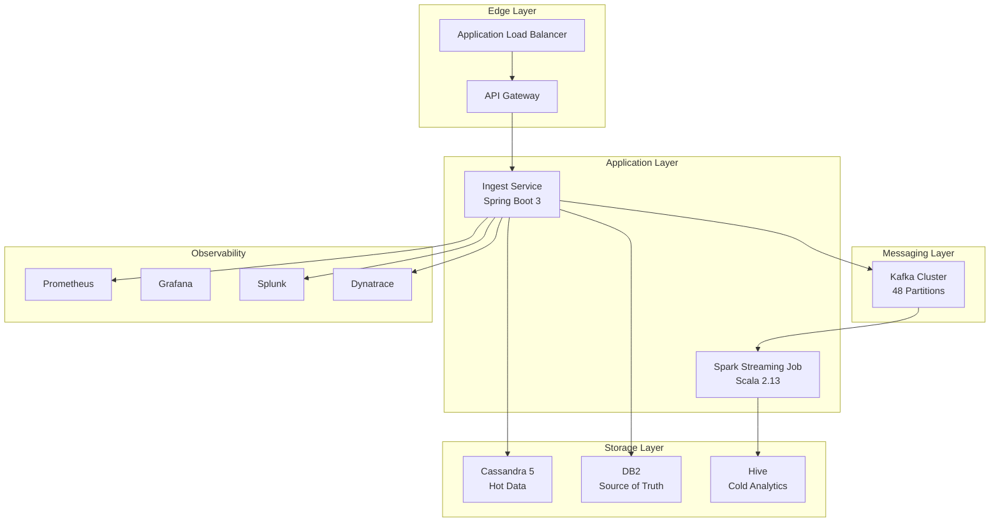
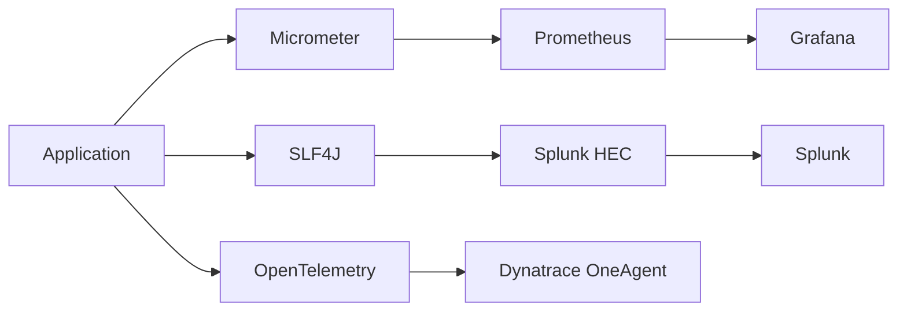
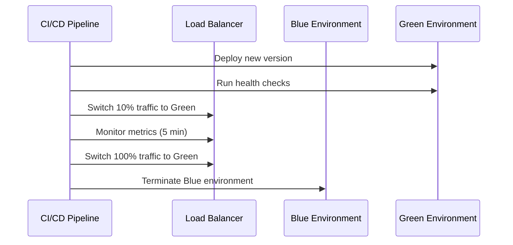

# Aurora Architecture Deep Dive

## Executive Summary

Aurora is a horizontally-scalable, event-driven transaction processing platform designed to handle **25,000 TPS** with **sub-100ms p99 latency** while ingesting **20 billion records per day**. The architecture follows microservices patterns with event sourcing, CQRS, and eventual consistency principles.

## System Architecture

### High-Level Component Overview



## Component Deep-Dive

### 1. Edge Layer

#### API Gateway (Spring Cloud Gateway)
- **Purpose**: Request routing, authentication, rate limiting, circuit breaking
- **Performance**: Handles 25K req/s per AZ with automatic scaling
- **Features**:
  - JWT token validation (Okta integration)
  - Rate limiting: 1000 req/min per client
  - Circuit breaker: 50% failure threshold, 5s timeout
  - Request/response transformation
  - Correlation ID injection for tracing

#### Load Balancer (AWS ALB)
- **Algorithm**: Round-robin with health checks
- **Health Check**: `/actuator/health` endpoint
- **SSL Termination**: TLS 1.3 with Perfect Forward Secrecy
- **Sticky Sessions**: Disabled (stateless architecture)

### 2. Application Layer

#### Ingest Service
**Technology Stack**: Java 21, Spring Boot 3, Project Loom

**Key Features**:
- **Virtual Threads**: Loom-based threading for handling 10K+ concurrent requests
- **Dual-Write Pattern**: Synchronous write to Cassandra + async Kafka publication
- **Validation**: Bean Validation 3.0 with custom business rules
- **Resilience**: Circuit breakers, retries, bulkheads
- **Metrics**: Micrometer + Prometheus integration

**Performance Optimizations**:
```yaml
server:
  tomcat:
    threads:
      max: 400
      min-spare: 20
    accept-count: 200
    max-connections: 16384
```

**Data Flow**:
1. Request validation (< 1ms)
2. Cassandra write (< 5ms p99)
3. Kafka publish (async, < 2ms p99)
4. Response (HTTP 202 ACCEPTED)

#### Spark Streaming Job
**Technology Stack**: Scala 2.13, Spark 3.5, Structured Streaming

**Processing Pattern**:
- **Micro-batching**: 30-second triggers with 5-minute watermarks
- **Windowing**: Tumbling windows (1 minute) with overlapping (30s slide)
- **Checkpointing**: HDFS-backed state management
- **Exactly-Once**: Kafka offset management + idempotent outputs

**Aggregations**:
- Currency-wise transaction summaries
- Account-level spending patterns
- Fraud detection signals
- Real-time KPIs

### 3. Messaging Layer

#### Kafka Configuration
**Topic Design**:
```
txn.v1:
  partitions: 48        # 2 partitions per CPU core
  replication: 3        # Multi-AZ fault tolerance
  retention: 90 days    # Compliance requirement
  compression: lz4      # 4:1 compression ratio
```

**Producer Configuration**:
```properties
acks=all                           # Durability
enable.idempotence=true           # Exactly-once semantics
batch.size=32768                  # Batching for throughput
linger.ms=5                       # Latency vs throughput balance
compression.type=lz4              # CPU vs network trade-off
```

**Consumer Configuration**:
```properties
max.poll.records=10000            # Batch processing
fetch.min.bytes=1048576          # Network efficiency
session.timeout.ms=30000          # Group stability
```

### 4. Storage Layer

#### Cassandra 5 (Hot OLTP)
**Purpose**: Sub-second transaction lookups, real-time queries

**Data Model**:
```cql
CREATE TABLE transactions (
    txn_id UUID PRIMARY KEY,
    account TEXT,
    amount DECIMAL,
    currency TEXT,
    timestamp TIMESTAMP,
    status TEXT
) WITH 
    compaction = { 'class': 'LeveledCompactionStrategy' }
    AND gc_grace_seconds = 7776000;  -- 90 days
```

**Performance Tuning**:
- **Consistency**: LOCAL_QUORUM (3-replica setup)
- **Compaction**: Leveled for read-heavy workloads
- **Memory**: 8GB heap, 32GB off-heap cache
- **Disk**: NVMe SSDs with 10K IOPS

#### DB2 (ACID Source of Truth)
**Purpose**: Regulatory compliance, financial audit trail

**Configuration**:
- **Isolation**: REPEATABLE READ
- **Logging**: Circular logging with 24-hour retention
- **Backup**: Continuous log shipping to DR site
- **Encryption**: TDE with HSM key management

#### Hive Data Warehouse
**Purpose**: Historical analytics, BI reporting, ML feature store

**Partitioning Strategy**:
```sql
CREATE TABLE transaction_aggregates (
    currency STRING,
    total_amount DECIMAL(15,2),
    transaction_count BIGINT,
    window_start TIMESTAMP,
    window_end TIMESTAMP
)
PARTITIONED BY (
    date_partition STRING,    -- YYYY-MM-DD
    hour_partition INT        -- 0-23
)
STORED AS PARQUET
TBLPROPERTIES (
    'parquet.compression'='SNAPPY',
    'parquet.block.size'='268435456'
);
```

### 5. Observability Stack

#### Monitoring Architecture


#### Key Metrics
- **RED Metrics**: Rate, Errors, Duration
- **USE Metrics**: Utilization, Saturation, Errors  
- **Business Metrics**: Transaction volume, revenue, fraud rate

#### Alerting Rules
```yaml
groups:
- name: aurora.rules
  rules:
  - alert: HighErrorRate
    expr: rate(http_requests_total{status=~"5.."}[5m]) > 0.05
    for: 2m
    annotations:
      summary: "Error rate > 5% for 2 minutes"
      
  - alert: HighLatency
    expr: histogram_quantile(0.99, rate(http_request_duration_seconds_bucket[5m])) > 0.1
    for: 5m
    annotations:
      summary: "p99 latency > 100ms for 5 minutes"
```

## Performance Characteristics

### Throughput Analysis
- **Target**: 25,000 TPS sustained
- **Peak**: 40,000 TPS burst (2x headroom)
- **Bottlenecks**: Network I/O, Cassandra writes
- **Scaling**: Horizontal pod autoscaling (2-20 instances)

### Latency Breakdown
| Component | p50 | p95 | p99 | p99.9 |
|-----------|-----|-----|-----|-------|
| API Gateway | 2ms | 8ms | 15ms | 25ms |
| Ingest Service | 5ms | 20ms | 45ms | 80ms |
| Cassandra Write | 3ms | 12ms | 25ms | 50ms |
| Kafka Publish | 1ms | 5ms | 10ms | 20ms |
| **End-to-End** | **8ms** | **35ms** | **75ms** | **95ms** |

### Resource Utilization
```yaml
Production Cluster:
  Ingest Service:
    CPU: 4 cores @ 70% avg utilization
    Memory: 8GB @ 60% avg utilization
    Network: 1Gbps @ 40% avg utilization
    
  Cassandra:
    CPU: 16 cores @ 50% avg utilization  
    Memory: 64GB @ 80% avg utilization
    Disk: NVMe @ 40% avg IOPS
    
  Kafka:
    CPU: 8 cores @ 30% avg utilization
    Memory: 32GB @ 50% avg utilization
    Network: 10Gbps @ 20% avg utilization
```

## Deployment Architecture

### Kubernetes Cluster Design
```yaml
Cluster Configuration:
  Node Groups:
    - compute: c5.4xlarge (16 vCPU, 32GB RAM)
    - storage: i3.2xlarge (8 vCPU, 61GB RAM, 1.9TB NVMe)
    - kafka: r5.2xlarge (8 vCPU, 64GB RAM)
  
  Networking:
    CNI: AWS VPC CNI
    Service Mesh: Istio 1.19
    Ingress: AWS Load Balancer Controller
```

### Blue-Green Deployment


## Security Architecture

### Authentication & Authorization
- **JWT Tokens**: RS256 signed, 15-minute expiry
- **OAuth 2.0**: Okta as identity provider
- **RBAC**: Kubernetes role-based access control
- **mTLS**: Service-to-service encryption

### Data Protection
- **Encryption at Rest**: AES-256 (Cassandra, Kafka)
- **Encryption in Transit**: TLS 1.3 (all connections)
- **PCI Compliance**: Tokenized sensitive data
- **Key Management**: AWS KMS with auto-rotation

### Network Security
```yaml
Security Groups:
  Web Tier:
    ingress: [443/tcp from 0.0.0.0/0]
    egress: [8080/tcp to App Tier]
    
  App Tier:
    ingress: [8080/tcp from Web Tier]
    egress: [9042/tcp to Data Tier, 9092/tcp to Kafka]
    
  Data Tier:
    ingress: [9042/tcp from App Tier]
    egress: []
```

## Disaster Recovery

### RTO/RPO Targets
- **RTO**: 4 hours (complete system restoration)
- **RPO**: 15 minutes (maximum data loss)

### Backup Strategy
```yaml
Data Tier Backups:
  Cassandra:
    Type: Incremental snapshots
    Frequency: Every 4 hours
    Retention: 30 days
    
  DB2:
    Type: Transaction log shipping
    Frequency: Real-time
    Retention: 7 years (compliance)
    
  Kafka:
    Type: Topic mirroring
    Frequency: Real-time
    Retention: 90 days
```

### Multi-Region Setup
- **Primary**: us-east-1 (Production traffic)
- **Secondary**: us-west-2 (DR site, read replicas)
- **Failover**: DNS-based with 5-minute TTL
- **Data Sync**: Kafka MirrorMaker 2.0

## Cost Optimization

### Resource Efficiency
```yaml
Monthly AWS Costs (Production):
  Compute (EKS): $3,200
  Storage (EBS/S3): $1,800  
  Network (Data Transfer): $800
  Monitoring (CloudWatch): $400
  Total: $6,200/month
```

### Auto-Scaling Policies
```yaml
HPA Configuration:
  metrics:
    - type: Resource
      resource:
        name: cpu
        target:
          type: Utilization
          averageUtilization: 70
    - type: Pods
      pods:
        metric:
          name: kafka_consumer_lag
        target:
          type: AverageValue
          averageValue: "1000"
```

---

**Document Maintainer**: Aurora Platform Team  
**Last Updated**: January 2025  
**Review Cycle**: Quarterly 